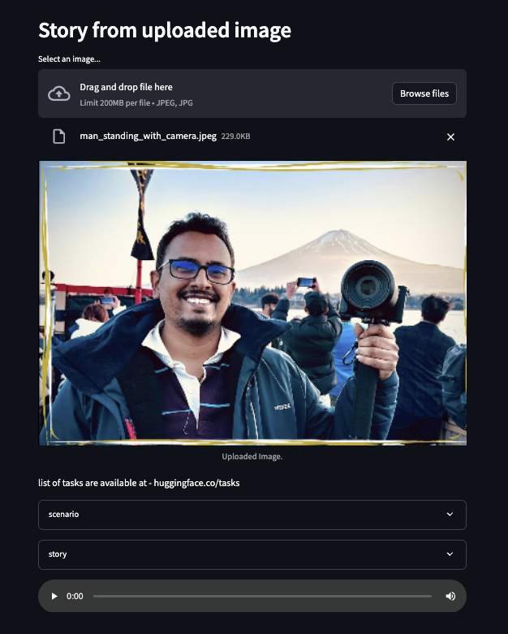

# Gen AI: A simple to generate a meaningful audio from uploaded photo

### Pre-requisites:
Install below libraries from requirements.txt file
```sh
pip install -r requirements.txt 
```
## Design info:
-   used hugging face to consume ready made AI models.
-   for image-to-text with model as "(salesforce/blip-image-captioning-base)" 
-   for text to audio with model as "kan-bayashi_ljspeech_vits". 
-   used langchain+Chat GPT to geenrate a text
-   published image to audio using streamlit
        
## Build and run?
    streamlit run app.py
## Image to Audio:



        
        